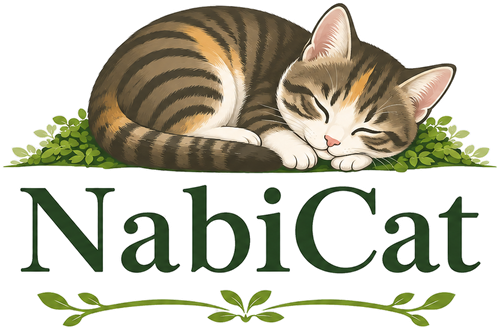

# NabiCat



A cozy collection of misc web apps [visit](https://nabicat.site)

## Setup

### Env

create a `.env` file in the root of the project with the following content:

* `FLASK_SECRET_KEY` - can be any random 24 char str

### Python and system dependencies

* install [uv](https://docs.astral.sh/uv/getting-started/installation/); it manages the pinned Python version and project environment
* install Redis and Deno (server setup provisions these)
* install `ffmpeg`
* install `terraform`

## Running

```bash
uv sync --locked
uv run --locked python -m web_app [--debug] [--port PORT]
```

Production installs use `uv sync --locked --no-dev`; development and production
checkouts each have their own `.venv`. Do not synchronize a running production
environment manually: `update_server.sh` stops services before replacing dependencies
and restores the previous locked environment if deployment fails.

## Testing

Run unit tests from the development checkout:

```bash
uv run --locked pytest tests/unit -q -m "not ffmpeg"
```

Tests supply their own secret key; no `FLASK_SECRET_KEY` environment variable is
needed. CI also runs the integration tests. Keep tests narrowly scoped on the
production host.

### Playwright UI Tests

```bash
uv sync --locked
uv run --locked playwright install
sudo .venv/bin/playwright install-deps
uv run --locked pytest tests/ui/ # run ui tests in headless mode

# to see whats actually being tested
# uv run --locked pytest tests/ui/ --headed --slowmo 500
```


## Cloud Setup

register host .ssh creds as github ssh key

then run client side setup

`source setup_server.sh && run_client_side $CLOUD_PROVIDER`

CLOUD_PROVIDER is either aws or oci (aws doesn't work atm as the instance doesnt have enough storage)

register the generated ip address with your domain name
`export SERVER_IP_ADDR=$(terraform -chdir=terraform/$CLOUD_PROVIDER output server_ip_addr | sed 's/\"//g')`

it may take a while for the ip to be associated with the domain, but once it's done run the final step.
Make sure to replace the email with your own for certbot

`ssh nabicat.site -t "ssh-keyscan github.com >> ~/.ssh/known_hosts 2>/dev/null && git clone git@github.com:quitefrankli/nabicat.git && cd nabicat && source setup_server.sh && CERTBOT_EMAIL=your@email.com run_server_side"`


### Systemd Services

`update_server.sh` generates and manages the long-running services plus a
templated oneshot service for scheduled jobs:

* `nabicat.service` — the gunicorn web app
* `meridian.service` — the Meridian LLM proxy used by LLM-backed app features
* `nabicat-scheduled-job@.service` — runs one host-local job under the app user

Three persistent timers invoke that template in the server's local timezone:

* `nabicat-backup.timer` — weekly backup, Sunday at 00:00
* `nabicat-cookie-keepalive.timer` — YouTube cookie keepalive, daily at 04:00
* `nabicat-download-health-check.timer` — Tubio download check, daily at 04:10

The scheduled service takes the same deployment lock as `update_server.sh`, so
a due job waits for an in-progress deployment rather than running against a
changing checkout.

```bash
sudo systemctl status nabicat meridian
systemctl list-timers 'nabicat-*'

# Run a job immediately when needed
sudo systemctl start nabicat-scheduled-job@backup.service
```

### Logs

stdout is captured by journald

```bash
journalctl -u nabicat -f      # for stdout/stderr from update_server.sh bash script
journalctl -u meridian -f     # live meridian logs
journalctl -u 'nabicat-scheduled-job@*' --since today
tail -f ~/.nabicat/data/logs/web_app.log  # structured web and scheduled-job events
```

### Claude Login (first-time Meridian setup)

Meridian proxies requests to the `claude` CLI, which needs to be authenticated once on the server as the same user the service runs under (whoever ran `setup_server.sh`):

```bash
claude login
sudo systemctl restart meridian
```


### Misc

to bring down the server

`terraform -chdir=terraform/$CLOUD_PROVIDER destroy`

## Updating Server

Push changes to `main` and wait for CI. To deploy, either:

* Push a release tag pointing to the current `main` commit; CI validates and deploys it.
* Run `uv run --locked python scripts/api_helper.py update` from the development checkout.
* Run `bash update_server.sh` from the production checkout on the server.

Pushing `main` alone runs tests; it does not automatically deploy.

The scheduled `Update yt-dlp` GitHub Actions workflow checks PyPI daily and can
also be run manually. It validates the updater before committing a newer stable
yt-dlp requirement and lockfile to `main`. Deploy the update through one of the
paths above.

## Renewing Cert

Renewal is automatic. `setup_server.sh` installs certbot via apt, which ships a `certbot.timer` systemd unit that runs `certbot renew` twice daily. Pre/post hooks (stop/start nginx) are stored in `/etc/letsencrypt/renewal/nabicat.site.conf` and run on each renewal.

To verify:

```bash
systemctl list-timers certbot.timer
sudo certbot renew --dry-run
```

To force a manual renewal:

```bash
sudo certbot renew --force-renewal
```
